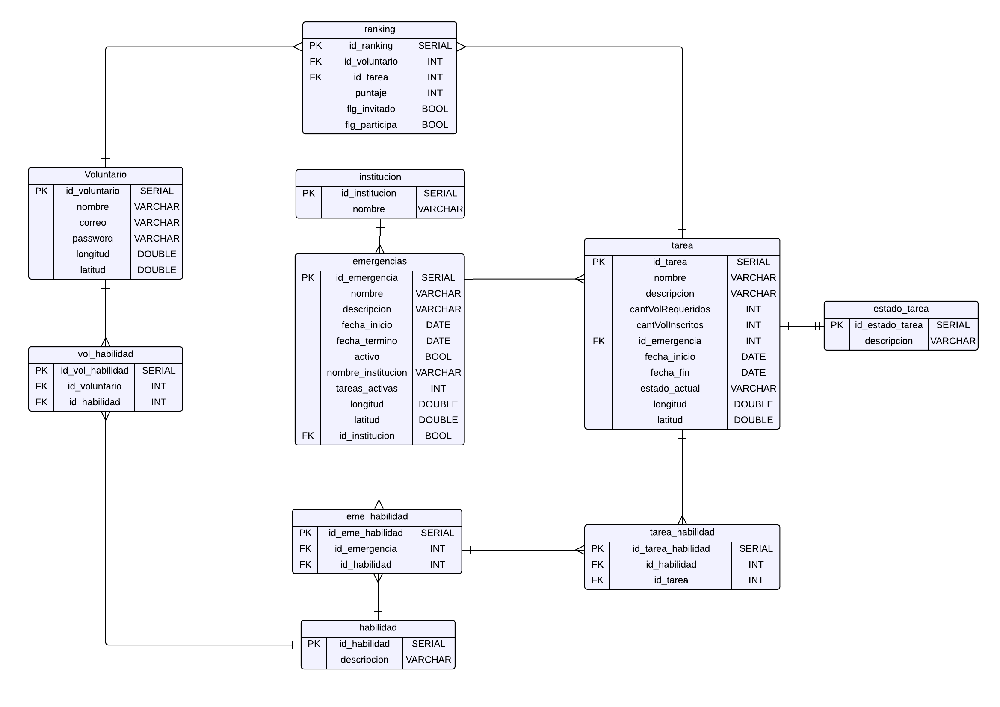

# Laboratorio 1 y 2 BDA
----

Laboratorio 1 y 2 de la asignatura de Base de Datos Avanzadas de la Universidad de Santiago de Chile ([USACH][9]).

# Tabla de contenidos
------

- [Laboratorio 1 y 2 BDA](#laboratorio-1-y-2-bda)
- [Tabla de contenidos](#tabla-de-contenidos)
- [Integrantes](#integrantes)
- [Uso](#uso)
- [Funcionalidades realizadas](#funcionalidades-realizadas)
- [Diagramas de Arquitectura](#diagramas-de-arquitectura)
  - [Vista Física](#vista-física)
  - [MER](#mer)

# Integrantes 
----
* [Samoth Godoy Madueño][8]
* [Matías Figueroa Contreras][6]
* [Cristóbal Marchant Osorio][7]
* [Diego Oliva López][5]
* [Juan Ramírez Montero][4]

# Uso
---
**En primer lugar**, se debe descargar npm para el frontend. Para hacerlo, se puede visitar la página oficial de [Node.js][1] y descargarlo desde allí. Una vez descargado e instalado, se debe abrir la consola en la carpeta del frontend y utilizar el comando "_**npm install**_". Este comando instalará todas las dependencias necesarias utilizadas en el proyecto, y luego para iniciar el frontend se debe realizar el comanndo "_**npm run dev**_".

Ademas tener en consideración, que se debe crear dentro de la raíz de la carpeta frontend un archivo llamado config.json, el cual deberá contener la llave de la API de Google Maps.

**A continuación**, para configurar el backend, es necesario descargar e instalar [PostgreSQL][3]. Durante la instalación, se debe asegurar la selección de la opción **_StackBuilder_**. Después de la instalación, se debe abrir  *StackBuilder* y seleccionar la versión correspondiente de PostgreSQL. Luego, dentro de las categorías disponibles, se debe marcar la opción **_Spatial Extensions_** y seleccionar **_PostGIS 3.3 Bundle for Postgres"_**. Una vez seleccionada, se debe descargar e instalar esta extensión. Una vez instalados PostgreSQL y PostGIS, se puede utilizar [IntelliJ IDEA][2] como entorno de desarrollo para trabajar con el Backend.

Para crear la base de datos, está el script [dbCreate.sql][10] donde se detallan las intrucciones de uso dentro del mismo archivo.

El archivo responsable de poblar la base de datos _desastresdb_ es [dump.sql][11]. Para lograr esto, es necesario crear una query tool en **pgAdmin** o ejecutar directamente las instrucciones en _SQL Shell_ mientras se encuentra en la base de datos _desastresdb_.

Es **importante** destacar que, para la correcta ejecución del proyecto, se debe contar con el API key correspondiente a la variable de entorno **"GOOGLE_MAPS_API_KEY"** en el archivo **config.json**. Por lo tanto, se debe solicitar y se enviará a la brevedad. En este caso, no se incluye en el proyecto debido a que el uso del API key es limitado y podría generar gastos no contemplados.

# Funcionalidades realizadas

---
**1.-**   Crear formulario de registro de usuario y autenticación (JWT u otros).

**2.-**  Crear trigger que almacene las queries de inserción, actualización o eliminación realizadas por el backend de su aplicación con la respectiva información de usuario, tiempo de llamada, etc.

**3.-**  Crear procedimiento almacenado que entregue un reporte con los usuarios que más queries de inserción, actualización o eliminación que ejecutan con las respectivas consultas.

**4.-**  Crear pantalla que muestre el listado de emergencias con su estado. Se debe poder activar o desactivar la emergencia.

**5.-**  En la pantalla anterior se debe mostrar el total de tareas activas en la emergencia, este cálculo se debe hacer con una función en la BD.

**6.-**  Se debe guardar la ubicación de la emergencia como punto en la BD.

**7.-**  Se debe guardar la ubicación de cada voluntario en la BD como punto

**8.-**  Generar datos de prueba de al menos 20 voluntarios dentro de Chile con su ubicación correspondiente.

**9.-**  Se debe obtener una lista de todos los voluntarios inscritos en una emergencia dentro del radio R de la emergencia. Se debe agregar el número **R** como parámetro en la llamada REST.

**10.-**  Se debe mostrar en una mapa todas las tareas  para una región seleccionada.

# Diagramas de Arquitectura 
---

## Vista Física 

## MER

[1]: https://nodejs.org/es
[2]: https://www.jetbrains.com/es-es/idea/download/#section=windows
[3]: https://www.postgresql.org/download/
[4]: https://github.com/jnramirezm
[5]: https://github.com/D4ig0
[6]: https://github.com/MatiasFigueroaContreras
[7]: https://github.com/cristowo
[8]: https://github.com/Samoth1
[9]: https://www.usach.cl/
[10]: https://github.com/D4ig0/Laboratorio-1-BDA/blob/main/dbCreate.sql
[11]: https://github.com/D4ig0/Laboratorio-1-BDA/blob/main/dump.sql