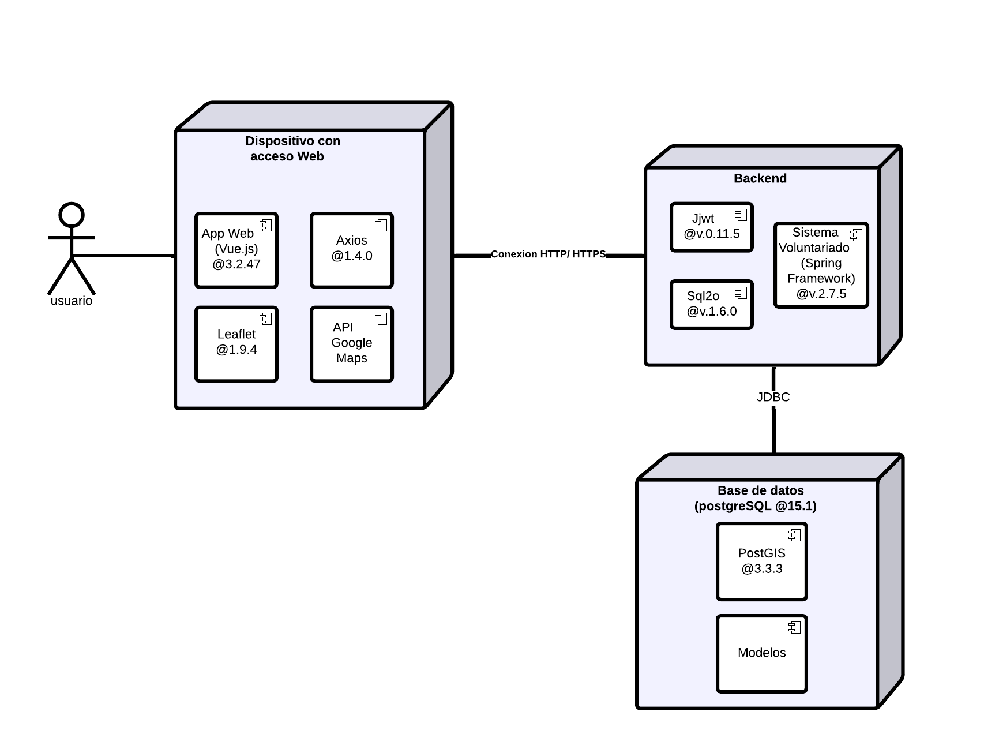

# Laboratorio 1 y 2 BDA
----

Laboratorio 1 y 2 de la asignatura de Base de Datos Avanzadas de la Universidad de Santiago de Chile ([USACH][9]).

# Tabla de contenidos
------

* [Integrantes](#Integrantes)
* [Funcionalidades](#Funcionalidades-realizadas)
* [¿Cómo se usa? ](#Uso)

#Integrantes 
----
* [Samoth Godoy Madueño][8]
* [Matías Figueroa Contreras][6]
* [Cristóbal Marchant Osorio][7]
* [Diego Oliva López][5]
* [Juan Ramírez Montero][4]

#Uso
---
**En primer lugar**, se debe descargar npm para el frontend. Para hacerlo, se puede visitar la página oficial de [Node.js][1] y descargarlo desde allí. Una vez descargado e instalado, se debe abrir la consola en la carpeta del frontend y utilizar el comando "_**npm install**_". Este comando instalará todas las dependencias necesarias utilizadas en el proyecto.

**A continuación**, para configurar el backend, es necesario descargar e instalar [PostgreSQL][3]. Durante la instalación, se debe asegurar la selección de la opción **_StackBuilder_**. Después de la instalación, se debe abrir  *StackBuilder* y seleccionar la versión correspondiente de PostgreSQL. Luego, dentro de las categorías disponibles, se debe marcar la opción **_Spatial Extensions_** y seleccionar **_PostGIS 3.3 Bundle for Postgres"_**. Una vez seleccionada, se debe descargar e instalar esta extensión. Una vez instalados PostgreSQL y PostGIS, se puede utilizar [IntelliJ IDEA][2] como entorno de desarrollo para trabajar con la base de datos.

#Funcionalidades realizadas
---
**1.-**   Crear formulario de registro de usuario y autenticación (JWT u otros).
**2.-**  Crear trigger que almacene las queries de inserción, actualización o eliminación realizadas por el backend de su aplicación con la respectiva información de usuario, tiempo de llamada, etc.
**3.-**  Crear procedimiento almacenado que entregue un reporte con los usuarios que más queries de inserción, actualización o eliminación que ejecutan con las respectivas consultas.
**4.-**  Crear pantalla que muestre el listado de emergencias con su estado. Se debe poder activar o desactivar la emergencia.
**5.-**  En la pantalla anterior se debe mostrar el total de tareas activas en la emergencia, este cálculo se debe hacer con una función en la BD.
**6.-**  Se debe guardar la ubicación de la emergencia como punto en la BD.
**7.-**  Se debe guardar la ubicación de cada voluntario en la BD como punto
**8.-**  Generar datos de prueba de al menos 20 voluntarios dentro de Chile con su ubicación correspondiente.
**9.-**  Se debe obtener una lista de todos los voluntarios inscritos en una emergencia dentro del radio R de la emergencia. Se debe agregar el número **R** como parámetro en la llamada REST.
**10.-**  Se debe mostrar en una mapa todas las tareas  para una región seleccionada.

# Diagramas de Arquitectura 
---
## Vista Física 

## MER

[1]: https://nodejs.org/es
[2]: https://www.jetbrains.com/es-es/idea/download/#section=windows
[3]: https://www.postgresql.org/download/
[4]: https://github.com/jnramirezm
[5]: https://github.com/D4ig0
[6]: https://github.com/MatiasFigueroaContreras
[7]: https://github.com/cristowo
[8]: https://github.com/Samoth1
[9]: https://www.usach.cl/